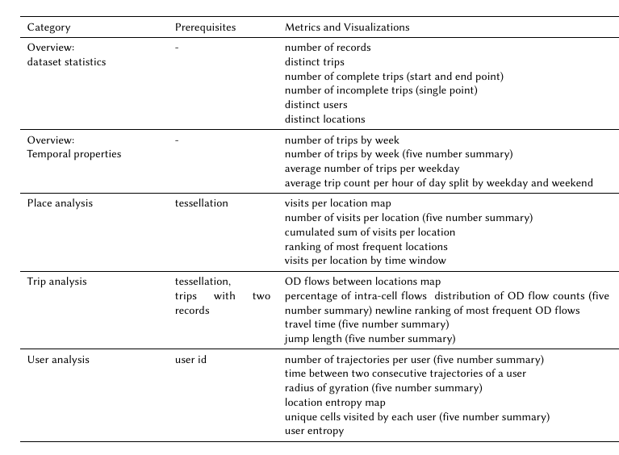

### Utility Metrics:

Wenn es ein direkter Anwendungsfall aus unserem Projekt sein soll, dann können wir dafür unseren Use Case 1 nehmen: „Mobility Data Report“. Daran arbeiten Saskia und ich gerade und damit wollen wir bis Mitte Dezember fertig sein. Dabei wird ein Report erstellt, der ein Großteil relevanter Basisstatistiken, die man oftmals zu Mobilitätsdaten berechnet, beinhaltet (siehe Screenshot). Wir verwenden hierfür dann verschiedene privacy Parameter und vergleichen die Ergebnisse auf den einzelnen Statistiken.
D.h., wir könnten den gleichen Report (ohne zusätzliche Privacy Parameter) einmal mit den Rohdaten und einmal mit den synthetischen Daten erzeugen und auf gleiche Weise vergleichen.
„Verglichen“ werden diese anhand von utility metrics wie dem relativen Fehler, der Kullback-Leibler divergence, der Jensen-Shannon divergence oder der Earth movers distance. Damit bin ich gerade auch noch beschäftigt, hier geeignete Metriken für die einzelnen Statistiken zu definieren.

Falls hier der gesamte Report zu Umfangreich ist, können wir auch nur einzelne Statistiken hier rausgreifen, beispielsweise die räumliche und zeitliche Verteilung. Grundsätzlich würde es hier aber sicherlich für dich Sinn ergeben, dich daran zu orientieren (oder einfach unsere Metriken zu übernehmen), dann musst du da nicht nochmal viel Arbeit reinstecken.
